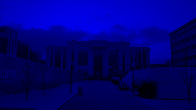
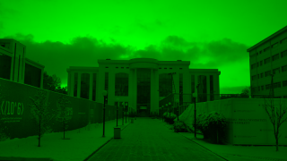
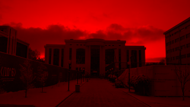
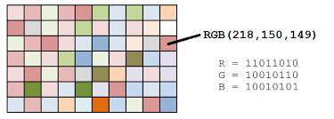
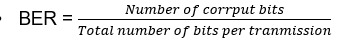
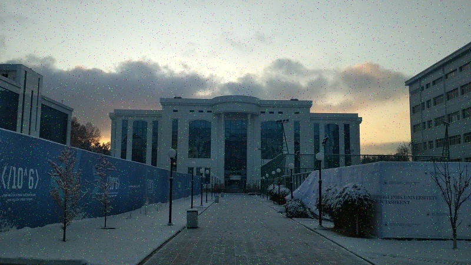
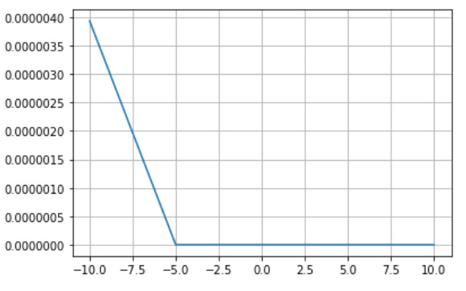

Mobile Communication Team\#3
============================

-   Boburjon Iskandarov 
-   Oybek Amonov 
-   Rakhmatjon Khasanov 
-   Sardorbek Allaberganov 
-   Bokhodir Urinboev 

### Needed Wrappers

* `OpenCV`
* `Numpy`
* `Matplotlib`

Signal conditioning 
===================








Opencv for loading 
==================

```python
pix = cv2.imread(file)
height, width, channels = pix.shape
demod_img = np.zeros((height, width, channels))
```

RGB to binary 
=============



```python
for i in range(height):
	for j in range(width):
        rgb=pix[i][j]
        binString=''
        for k in np.arange(3):
            binary = bin(rgb[k])[2:].zfill(8)
            binString += binary
        signal = np.array(bpsk(binString)).flatten()				
```

Digital to Analog Modulation 
============================

```python
def bpsk(binString):
    amplitude = []
    for i in range(len(binString)):
        if binString[i] == '1':
            amplitude.append(np.sin(time))
        else :
            amplitude.append(-np.sin(time))
    return amplitude
```


Simulating Noise 
================

```python
def awgn(signal, regsnr):
    noise = np.random.randn(len(signal))
    noise_var = 0.5*10**(-regsnr/10)
    Chan_Noise = noise * np.sqrt(noise_var)
    return Chan_Noise
```


Demodulation 
============

```python
carr = np.sin(time)
def bpsk_demod(signal, L):
    d = ''
    for i in range(0, len(signal), L):
        sum = np.sum([signal[i+j]*carr[j] for j in range(L)])
        if sum >= 0:
            d += '1'
        else:
            d += '0'
    return d
```

Detection 
=========

```python
def NEB(binString, demodBinString):
	return sum(1 for a, b in zip(binString, demodBinString)\
               if a != b) + abs(len(binString) - len(demodBinString))
```

Bit Error rate(BER) 
===================



```python
BER = []
for i in range(-10,11,5):
    %matplotlib inline
    BER.append(simulate(i, file))
%matplotlib inline
plt.figure()
plt.grid()
plt.plot(range(-10,11,5), BER)
plt.show()
```

Reconstructe Image
==================

```python
    demod_img[i][j] = [int(demodBinString[0:8],2), int(demodBinString[8:16],2), int(demodBinString[16:24],2)]
    BER += NEB(binString,demodBinString)
cv2.imwrite('photo_'+str(SNR)+'.jpg', demod_img)
```

### SNR = -15

| Before       | After              |
| ------------ | ------------------ |
|  |  |

### SNR = -10

| Before       | After              |
| ------------ | ------------------ |
|  |  |

### SNR = -5

| Before       | After             |
| ------------ | ----------------- |
|  |  |

### SNR = 0

| Before       | After            |
| ------------ | ---------------- |
|  |  |

### SNR = 5

| Before       | After            |
| ------------ | ---------------- |
|  |  |

### SNR = 10

| Before       | After             |
| ------------ | ----------------- |
|  |  |


